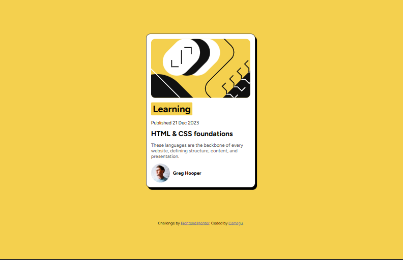

# Frontend Mentor - Blog preview card solution

This is a solution to the [Blog preview card challenge on Frontend Mentor](https://www.frontendmentor.io/challenges/blog-preview-card-ckPaj01IcS). Frontend Mentor challenges help you improve your coding skills by building realistic projects.

## Table of contents

- [Overview](#overview)
  - [The challenge](#the-challenge)
  - [Screenshot](#screenshot)
  - [Links](#links)
- [My process](#my-process)
  - [Built with](#built-with)
  - [What I learned](#what-i-learned)
  - [Continued development](#continued-development)
- [Author](#author)

## Overview

### The challenge

Users should be able to:

- See hover and focus states for all interactive elements on the page

### Screenshot



### Links

- Solution URL: [https://camagu-mgadle.github.io/blog-preview-card/](https://camagu-mgadle.github.io/blog-preview-card)
- Live Site URL: [https://qoncetimes.netlify.app/](https://qoncetimes.netlify.app/)

## My process

### Built with

- For markup use sementic HTML5 structure:
  - main
    - article
  - footer
- Use flexbox Model
- Google fonts for font face property:

### What I learned

- used an article element instead of using a simple div tag.

```html:
<article>Sementic HTML</article>
```

- Used the font face property on the body.

```css
@font-face {
  font-family: "Figtree";
  src: url(assets/fonts/Figtree-VariableFont_wght.ttf);
}

body {
  font-family: "Figtree";
}
```

- add hover state to the article element

  ```css:
  article:hover {
  transform: translate(-3px);
  box-shadow:
    0 10px 15px -3px rgb(0 0 0 / 0.1),
    0 4px 6px -4px rgb(0 0 0 / 0.1);
  }
  ```

- Use Flexbox to center the card

### Continued development

- Understanding how to use html attributes for more accessible web content.
- Learn more about css properties like the @font face, and how to link it.
- What is flexbox and flex items?
  - how to manipulate them

## Author

- Website - [Camagu](https://mgadleca.netlify.app/)
- Frontend Mentor - [@camagu](https://www.frontendmentor.io/profile/camagu)
- linkedin - [@camagu](https://www.linkedin.com/in/camagu-mgadle)
